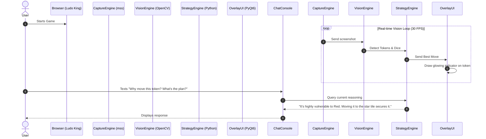

# C-Programming
Assignment for attendance on 25.04.2026

## Name: Markandeyan Gokul
## Register Number: 212224240086

## Questions

## 1. Write a C program to traverse a 2D matrix and print the values until a negative number is found. Use break statement.

### Program
```c
#include <stdio.h>

int main() {
    int matrix[3][3] = {
        {1, 2, 3},
        {4, 5, 6},
        {7, -8, 9}
    };
    int i, j;
    int found_negative = 0;

    printf("Traversing the 2D matrix:\n");
    for(i = 0; i < 3; i++) {
        for(j = 0; j < 3; j++) {
            if(matrix[i][j] < 0) {
                printf("\nNegative number %d found. Stopping traversal.\n", matrix[i][j]);
                found_negative = 1;
                break;
            }
            printf("%d ", matrix[i][j]);
        }
        if(found_negative) {
            break;
        }
    }
    return 0;
}
```
### Output


## 2. Write a C program to print the numbers from 1 to 100 but avoid printing multiples of 3 and number containing digit 5(5,15,25,35,..). Use continue in the program.

### Program
```c
#include <stdio.h>

int main() {
    int i;
    printf("Numbers from 1 to 100 avoiding multiples of 3 and numbers containing 5:\n");
    for(i = 1; i <= 100; i++) {
        // Skip multiples of 3
        if(i % 3 == 0) {
            continue;
        }
        // Skip numbers containing digit 5 (e.g., 5, 15, 50, 51...)
        if(i % 10 == 5 || i / 10 == 5) {
            continue;
        }
        printf("%d ", i);
    }
    printf("\n");
    return 0;
}
```
### Output


## 3.Write a C program that performs division of two user inputs and uses goto to handle errors like division by zero or invalid input by redirecting control for re-entry.

### Program
```c
#include <stdio.h>

int main() {
    float a, b;
    int items;
    
input_label:
    printf("Enter numerator and denominator: ");
    items = scanf("%f %f", &a, &b);
    
    // Clear the input buffer if invalid input
    if (items != 2) {
        while(getchar() != '\n');
        printf("Invalid input. Please enter numbers only.\n");
        goto input_label;
    }
    
    if(b == 0) {
        printf("Error: Division by zero is not allowed.\n");
        goto input_label;
    }
    
    printf("Result: %.2f / %.2f = %.2f\n", a, b, a/b);
    return 0;
}
```
### Output


## 4.Write a C program for a number guessing game where the loop continues for wrong guesses, breaks on a correct guess, and exits the program using return if the user enters -1.
### Program
```c
#include <stdio.h>

int main() {
    int target = 42;
    int guess;

    printf("Welcome to the Number Guessing Game!\n");
    
    while(1) {
        printf("Enter your guess (or -1 to exit): ");
        if (scanf("%d", &guess) != 1) {
            while(getchar() != '\n'); // clear buffer
            printf("Invalid input. Try again.\n");
            continue;
        }
        
        if(guess == -1) {
            printf("Exiting the program.\n");
            return 0;
        }
        
        if(guess == target) {
            printf("Congratulations! You guessed correctly.\n");
            break;
        } else {
            printf("Wrong guess. Try again.\n");
        }
    }
    return 0;
}
```
### Output


## 5. Write a C program that iterates through an array and, within a loop, uses continue to skip negative elements, break when a zero is encountered, and return to exit the program if an element greater than 100 is found, then print the resulting behavior for the array {10, -5, 20, 0, 150, 30}.
### Program
```c
#include <stdio.h>

int main() {
    int arr[] = {10, -5, 20, 0, 150, 30};
    int size = sizeof(arr)/sizeof(arr[0]);
    int i;
    
    printf("Processing array elements...\n");
    for(i = 0; i < size; i++) {
        if(arr[i] > 100) {
            printf("Element %d is greater than 100. Returning and exiting program.\n", arr[i]);
            return 0; 
        }
        if(arr[i] < 0) {
            printf("Skipping negative element: %d\n", arr[i]);
            continue;
        }
        if(arr[i] == 0) {
            printf("Zero encountered. Breaking the loop.\n");
            break;
        }
        printf("Processed element: %d\n", arr[i]);
    }
    
    printf("Loop exited.\n");
    return 0;
}
```
### Output

