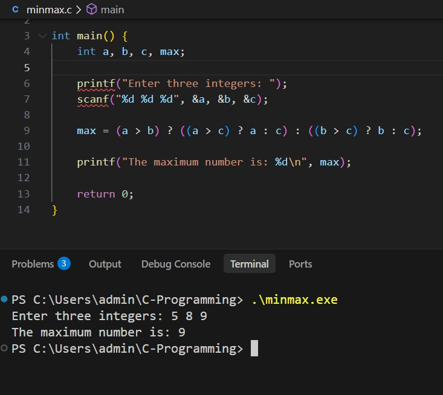
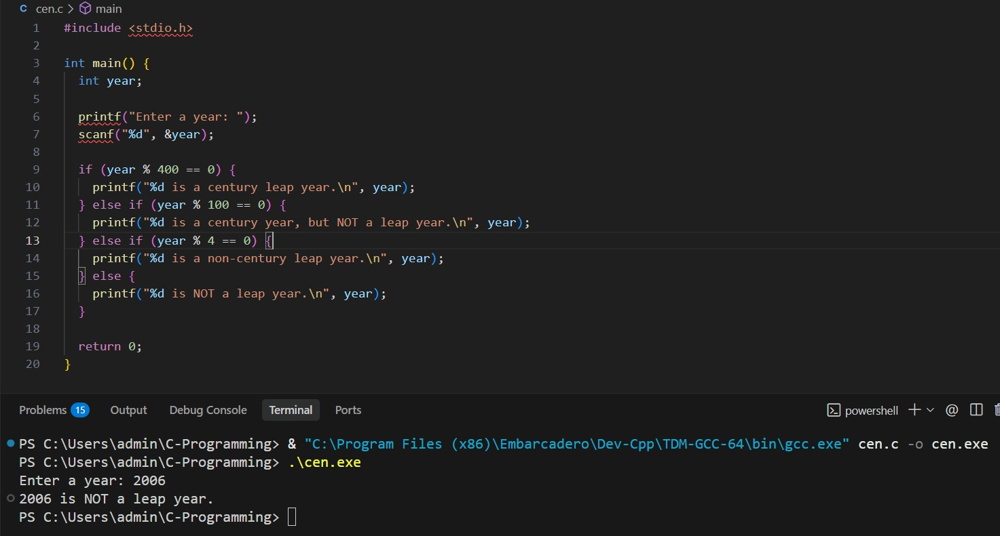
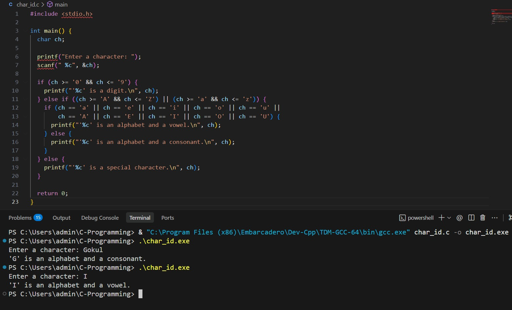
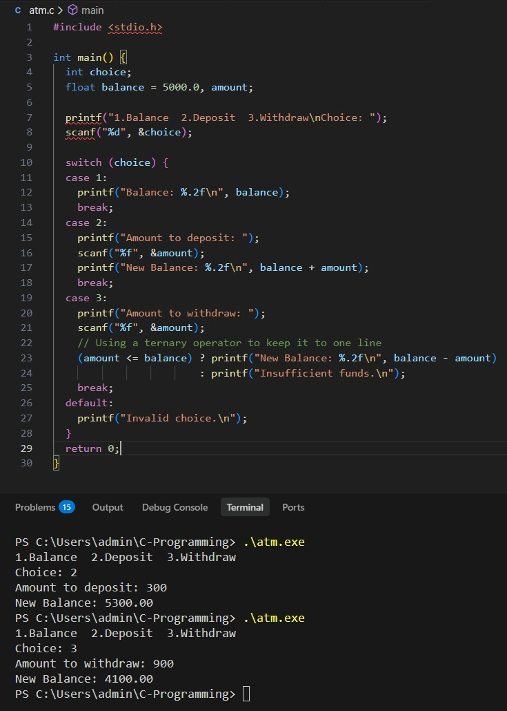
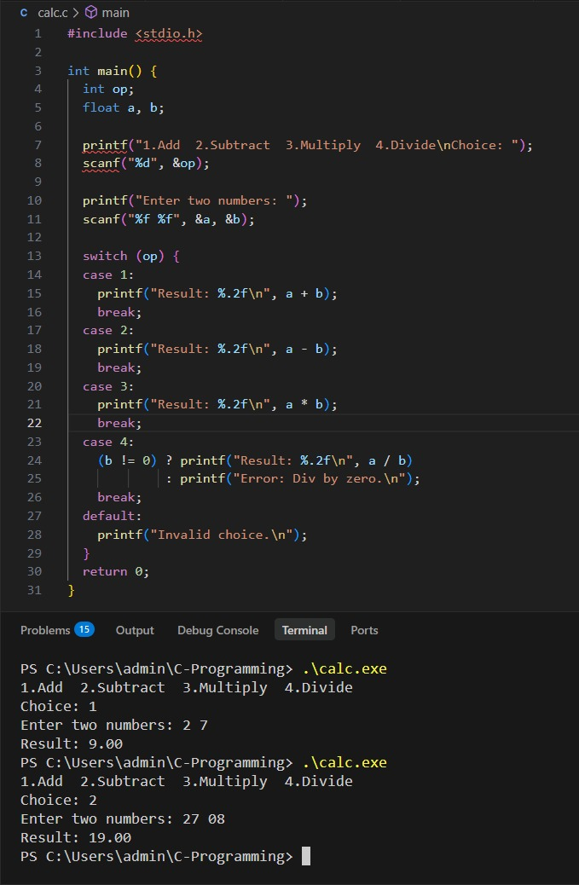

# C-Programming
Assignment for attendance on 24.04.2026

Name: Markandeyan Gokul
Register Number: 212224240086

## Questions

## 1. Write a C program to find the maximum of three numbers without using logical operators.
### Program
```c
#include <stdio.h>

int main() {
    int a, b, c, max;
    
    printf("Enter three integers: ");
    scanf("%d %d %d", &a, &b, &c);
    
    max = (a > b) ? ((a > c) ? a : c) : ((b > c) ? b : c);
    
    printf("The maximum number is: %d\n", max);
    
    return 0;
}
```
### Output


## 2.  Write a  C program to check whether the given year is leap year or not by adding century leap year or non-century leap year in the output (Eg: 2000 is a century leap year, 2024 is a non-century leap year)
### Program
```c
#include <stdio.h>

int main() {
  int year;

  printf("Enter a year: ");
  scanf("%d", &year);

  if (year % 400 == 0) {
    printf("%d is a century leap year.\n", year);
  } else if (year % 100 == 0) {
    printf("%d is a century year, but NOT a leap year.\n", year);
  } else if (year % 4 == 0) {
    printf("%d is a non-century leap year.\n", year);
  } else {
    printf("%d is NOT a leap year.\n", year);
  }

  return 0;
}
```
### Output


## 3. Write a C program to find whether the entered character is alphabet / digit / special character. If the entered character is an alphabet then say it is vowel or consonant without using built in functions.
### Program
```c
#include <stdio.h>

int main() {
  char ch;

  printf("Enter a character: ");
  scanf(" %c", &ch);

  if (ch >= '0' && ch <= '9') {
    printf("'%c' is a digit.\n", ch);
  } else if ((ch >= 'A' && ch <= 'Z') || (ch >= 'a' && ch <= 'z')) {
    if (ch == 'a' || ch == 'e' || ch == 'i' || ch == 'o' || ch == 'u' ||
        ch == 'A' || ch == 'E' || ch == 'I' || ch == 'O' || ch == 'U') {
      printf("'%c' is an alphabet and a vowel.\n", ch);
    } else {
      printf("'%c' is an alphabet and a consonant.\n", ch);
    }
  } else {
    printf("'%c' is a special character.\n", ch);
  }

  return 0;
}
```
### Output


## 4. Write a  C program for simple ATM simulation with operations Check Balance, Deposit,  Withdraw,  Exit using switch and update balance accordingly.
### Program
```c
#include <stdio.h>

int main() {
  int choice;
  float balance = 5000.0, amount;

  printf("1.Balance  2.Deposit  3.Withdraw\nChoice: ");
  scanf("%d", &choice);

  switch (choice) {
  case 1:
    printf("Balance: %.2f\n", balance);
    break;
  case 2:
    printf("Amount to deposit: ");
    scanf("%f", &amount);
    printf("New Balance: %.2f\n", balance + amount);
    break;
  case 3:
    printf("Amount to withdraw: ");
    scanf("%f", &amount);
    // Using a ternary operator to keep it to one line
    (amount <= balance) ? printf("New Balance: %.2f\n", balance - amount)
                        : printf("Insufficient funds.\n");
    break;
  default:
    printf("Invalid choice.\n");
  }
  return 0;
}
```
### Output


## 5. Write a C program for menu driven calculator using switch statement.
### Program
```c
#include <stdio.h>

int main() {
  int op;
  float a, b;

  printf("1.Add  2.Subtract  3.Multiply  4.Divide\nChoice: ");
  scanf("%d", &op);

  printf("Enter two numbers: ");
  scanf("%f %f", &a, &b);

  switch (op) {
  case 1:
    printf("Result: %.2f\n", a + b);
    break;
  case 2:
    printf("Result: %.2f\n", a - b);
    break;
  case 3:
    printf("Result: %.2f\n", a * b);
    break;
  case 4:
    (b != 0) ? printf("Result: %.2f\n", a / b)
             : printf("Error: Div by zero.\n");
    break;
  default:
    printf("Invalid choice.\n");
  }
  return 0;
}
```
### Output

